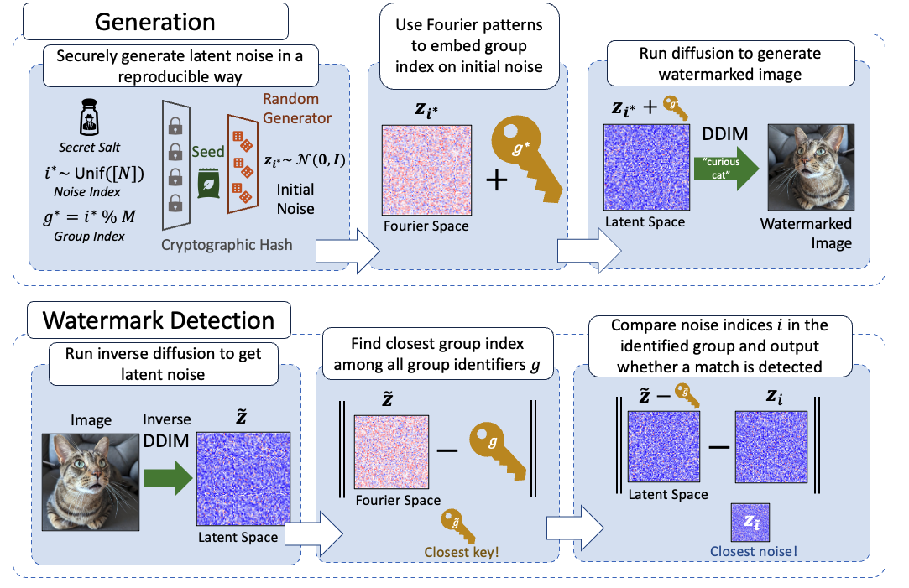

<div align="center">
  <h1>Hidden in the Noise: Two-Stage Robust Watermarking for Images</h1>
  
  
</div>

---

### About

We demonstrate that the initial noise used by the diffusion model to generate images can serve as a distortion-free watermark, but detecting it requires comparing the inversed noise with all previously used noises. To address these limitations, we propose a two-stage framework, **WIND**, that divides initial noises into groups and embeds group identifiers into them. For detection, we first retrieve the group and then identify the matching noise.

### Setup

To install the dependencies, run the `setup.sh` script:

```bash
chmod +x setup.sh
./setup.sh
```

### Usage

#### WIND Full

```python
python WIND_full.py --online
```

#### WIND Fast

```python
python WIND_fast.py --online
```

#### WIND Inpainting

First, download the COCO examples metadata (5000 examples) from Google Drive:
https://drive.google.com/drive/folders/1saWx-B3vJxzspJ-LaXSEn5Qjm8NIs3r0

Then run the inpainting watermarking script:
```bash
python inpainting.py --online
```

#### Other Experiments

Please check the `initial_noise` branch for the code related to other experiments discussed in the paper.

### Citation

If you find this work useful for your research, please consider citing our paper:


```
@article{arabi2024hidden,
  title={Hidden in the Noise: Two-Stage Robust Watermarking for Images},
  author={Arabi, Kasra and Feuer, Benjamin and Witter, R Teal and Hegde, Chinmay and Cohen, Niv},
  journal={arXiv preprint arXiv:2412.04653},
  year={2024}
}
```
